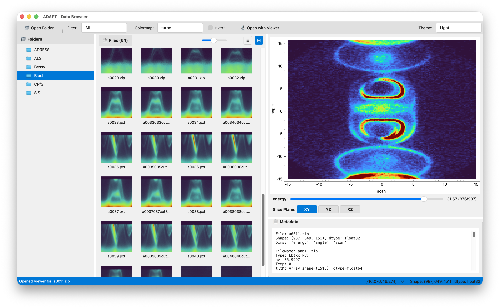
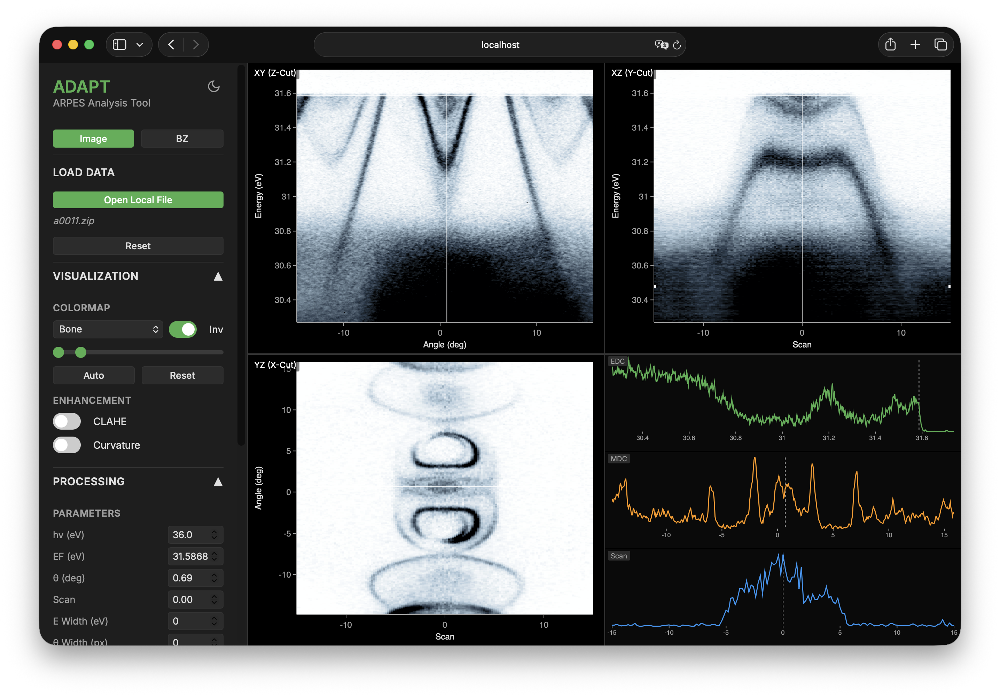

# ADAPT - ARPES Data Analysis & Processing Tool

ADAPT is a comprehensive toolkit designed for the visualization and analysis of Angle-Resolved Photoemission Spectroscopy (ARPES) data. It combines a powerful desktop data browser with a high-performance web-based 3D visualization engine.

## Screenshots

<p align="center">
  
  
</p>

## Features

*   **Data Browser (Desktop)**: A PyQt-based desktop application for browsing, inspecting, and managing ARPES datasets.
*   **3D Viewer (Web)**: An interactive web-based 3D visualizer for exploring volumetric ARPES data (EDC, MDC, isoline cuts).
*   **Integrated Workflow**: Seamlessly switch between the browser and the 3D viewer.
*   **Data Support**: Supports standard ARPES data formats (HDF5, Igor Binary Wave).
*   **Brillouin Zone Visualization**: 
    *   3D construction from lattice parameters or Materials Project ID.
    *   Interactive intersection plane visualization (Miller indices, distance, custom color).

## Installation

### 1. Get the Source Code (Two Ways)

**Method A: Download ZIP (Easiest)**
1. Click the blue **"<> Code"** button at the top of this GitHub page.
2. Select **"Download ZIP"**.
3. Extract the ZIP file and open the folder.

**Method B: Git Clone (For Developers)**
```bash
git clone https://github.com/quantum-ctrl/ADAPT.git
cd ADAPT
```

### 2. Environment Setup

Select the instructions for your operating system:

#### macOS
1.  **Install Homebrew** (if not already installed):
    ```bash
    /bin/bash -c "$(curl -fsSL https://raw.githubusercontent.com/Homebrew/install/HEAD/install.sh)"
    ```
2.  **Install Python 3**:
    ```bash
    brew install python
    ```
3.  **Create Virtual Environment**:
    ```bash
    python3 -m venv venv
    ```
4.  **Activate Virtual Environment**:
    ```bash
    source venv/bin/activate
    ```
5.  **Install Dependencies**:
    ```bash
    pip install -r requirements.txt
    ```


#### Windows
1.  **Install Python 3**:
    Download and install Python 3.9+ from [python.org](https://www.python.org/downloads/). Ensure you check **"Add Python to PATH"** during installation.
2.  **Create Virtual Environment**:
    Open PowerShell or Command Prompt and run:
    ```powershell
    python -m venv venv
    ```
3.  **Activate Virtual Environment**:
    ```powershell
    .\venv\Scripts\activate
    ```
4.  **Install Dependencies**:
    ```powershell
    pip install -r requirements.txt
    ```


#### Linux (Ubuntu/Debian)
1.  **Install System Dependencies**:
    ```bash
    sudo apt update
    sudo apt install python3 python3-venv python3-pip git
    ```
2.  **Create Virtual Environment**:
    ```bash
    python3 -m venv venv
    ```
3.  **Activate Virtual Environment**:
    ```bash
    source venv/bin/activate
    ```
4.  **Install Dependencies**:
    ```bash
    pip install -r requirements.txt
    ```


## Usage

### macOS / Linux (using `run.sh`)

The specific components can be launched using the `run.sh` helper script.

#### Launching Both (Recommended)
```bash
./run.sh both
```

#### Launching Components Individually
- **Data Browser**: `./run.sh browser`
- **3D Viewer**: `./run.sh viewer`

### Windows

To run both the Browser and Viewer, open two terminals and run:

**Terminal 1 (Viewer):**
```powershell
cd ADAPT_viewer
python -m uvicorn server:app --host 0.0.0.0 --port 8000 --reload
```

**Terminal 2 (Browser):**
```powershell
cd ADAPT_browser
python app.py
```

## Project Structure

*   `ADAPT_browser/`: Desktop GUI application code.
*   `ADAPT_viewer/`: Web server and visualization code.
*   `shared/`: Shared utilities and libraries.
*   `requirements.txt`: Python package dependencies.
*   `run.sh`: Main launcher script.


## License

This project is licensed under the MIT License - see the [LICENSE](LICENSE) file for details.

## Acknowledgements

Special thanks to:

*   Procopios Constantinou for the [ARPEScape](https://github.com/c0deta1ker/ARPEScape) project.
*   Craig Polley for the [pesto](https://gitlab.com/flashingLEDs/pesto) project.

