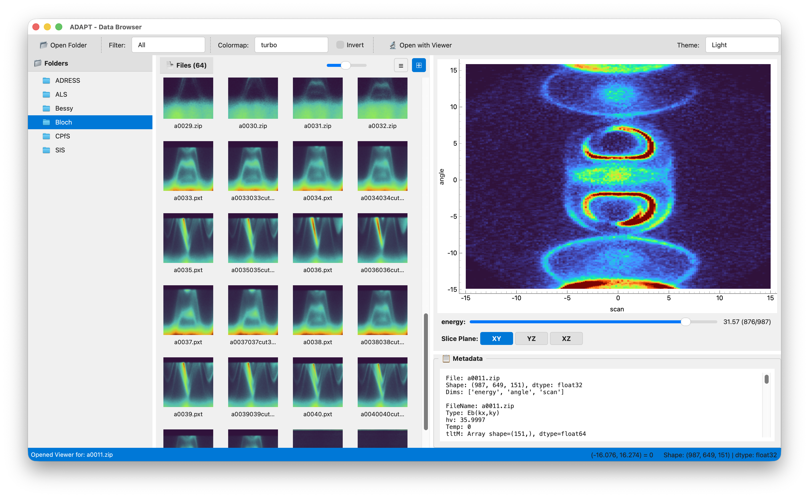
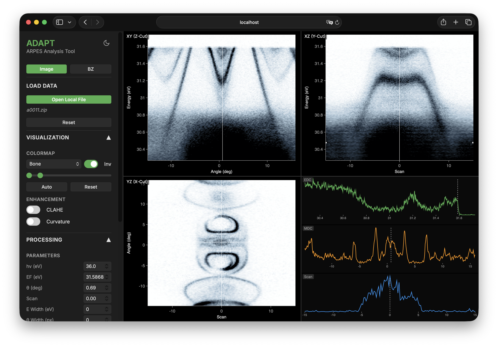

# ADAPT - ARPES Data Analysis & Processing Tool

ADAPT is a comprehensive toolkit designed for the visualization and analysis of Angle-Resolved Photoemission Spectroscopy (ARPES) data. It combines a powerful desktop data browser with a high-performance web-based 3D visualization engine.

## Screenshots

| ADAPT Browser | ADAPT Edit |
| :---: | :---: |
|  |  |

## Features

*   **Data Browser (Desktop)**: A PyQt-based desktop application for browsing, inspecting, and managing ARPES datasets.
*   **3D Viewer (Web)**: An interactive web-based 3D visualizer for exploring volumetric ARPES data (EDC, MDC, isoline cuts).
*   **Integrated Workflow**: Seamlessly switch between the browser and the 3D viewer.
*   **Data Support**: Supports standard ARPES data formats (HDF5/Nexus, Igor Binary Wave, SES ZIP, PXT/PXP).
*   **Brillouin Zone Visualization**: 
    *   3D construction from lattice parameters or Materials Project ID.
    *   Interactive intersection plane visualization (Miller indices, distance, custom color).

## Installation

### 1. Get the Source Code (Two Ways)

**Method A: Download ZIP (Easiest)**
1. Click the blue **"<> Code"** button at the top of this GitHub page.
2. Select **"Download ZIP"**.
3. Extract the ZIP file and open the folder.

**Method B: Git Clone (For Developers)**
```bash
git clone https://github.com/quantum-ctrl/ADAPT.git
cd ADAPT
```

### 2. Install uv

ADAPT uses [uv](https://docs.astral.sh/uv/) for dependency management and launching.

#### macOS / Linux
```bash
curl -LsSf https://astral.sh/uv/install.sh | sh
```

#### Windows
```powershell
powershell -ExecutionPolicy ByPass -c "irm https://astral.sh/uv/install.ps1 | iex"
```

### 3. Install Dependencies

From the project root:

```bash
uv sync
```


## Usage

Start ADAPT with the desktop Browser and web Edit viewer together:

```bash
uv run adapt
```

Optionally open an initial folder:

```bash
uv run adapt /path/to/data
```

ADAPT Edit is served at `http://127.0.0.1:8000` by default. To use a different
host or port:

```bash
uv run adapt --host 127.0.0.1 --port 8001
```

## Supported Data

ADAPT can open:

*   HDF5/Nexus files: `.h5`, `.hdf5`, `.nxs`
*   Igor Binary Wave files: `.ibw`
*   SES archives: `.zip`
*   Igor packed experiment files: `.pxt`, `.pxp`

HDF5 loading tries the ADRESS format first and then falls back to SIS.

## Configuration

These environment variables can be set before starting ADAPT Edit:

| Variable | Default | Description |
| :--- | :--- | :--- |
| `ADAPT_HOST` | `127.0.0.1` | Host used by the web server. |
| `ADAPT_PORT` | `8000` | Port used by the web server. |
| `ADAPT_DATA_DIR` | `ADAPT_edit/data` | Directory scanned by `/api/files`. |
| `ADAPT_MAX_UPLOAD_SIZE` | `2000000000` | Maximum upload size in bytes. |
| `ADAPT_BROWSE_ROOTS` | data dir and home | Path-list of directories allowed in the web file browser. |
| `ADAPT_ALLOW_FILESYSTEM_BROWSE` | `false` | Set to `1` to allow unrestricted local filesystem browsing. |

On macOS/Linux, separate multiple `ADAPT_BROWSE_ROOTS` entries with `:`. On Windows, use `;`.

## Testing

Run the smoke test suite from the project root:

```bash
uv run python -m unittest discover -s tests
```

Run a Python syntax/import compile check:

```bash
uv run python -m compileall ADAPT_browser ADAPT_edit shared tests adapt_cli.py
```

## Troubleshooting

*   **Port already in use**: start ADAPT with another port, for example `uv run adapt --port 8001`.
*   **Browser opens Edit but the page does not load**: confirm the `uv run adapt` terminal is still running and retry **Open with Viewer**.
*   **A directory is blocked in the web file browser**: add it to `ADAPT_BROWSE_ROOTS`, or set `ADAPT_ALLOW_FILESYSTEM_BROWSE=1` for unrestricted local browsing.
*   **Python dependency errors**: run `uv sync` from the project root.

## Project Structure

*   `ADAPT_browser/`: Desktop GUI application code.
*   `ADAPT_edit/`: Web server and visualization code.
*   `shared/`: Shared utilities and libraries.
*   `tests/`: Smoke tests for shared loading, saving, and configuration.
*   `pyproject.toml`: Python package metadata, dependencies, and `adapt` CLI entry point.


## License

This project is licensed under the MIT License - see the [LICENSE](LICENSE) file for details.

## Acknowledgements

Special thanks to:

*   Procopios Constantinou for the [ARPEScape](https://github.com/c0deta1ker/ARPEScape) project.
*   Craig Polley for the [pesto](https://gitlab.com/flashingLEDs/pesto) project.
